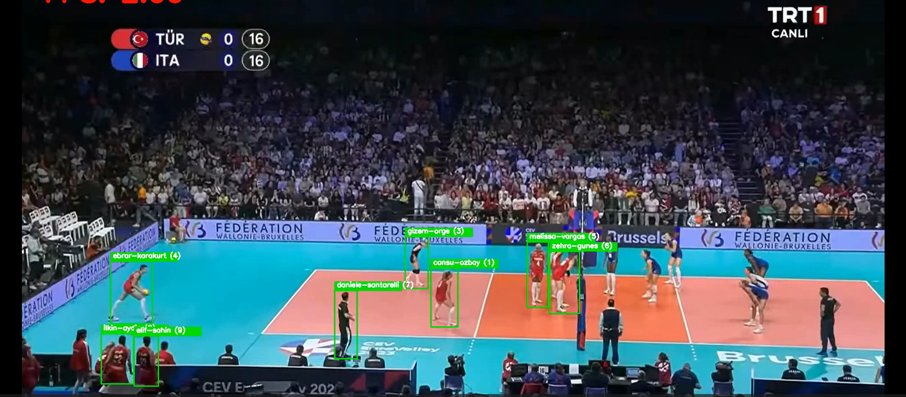

# Volleyball Player Tracker

## Overview
The **Volleyball Player Tracker** is a computer vision-based system designed to detect and track volleyball players in a video. Using advanced object detection and tracking algorithms, the system assigns unique IDs to each player and displays their names in real time.

## Technologies Used

- **YOLOv8**: Utilized for object detection, enabling accurate player identification in each frame.
- **DeepSORT**: Employed for tracking players by assigning unique IDs and maintaining their identities across frames.
- **OpenCV**: Used for video processing, drawing bounding boxes, and displaying results.
- **Python**: The primary programming language for implementing the tracking system.
- **CVAT**: Used for data labeling, ensuring a high-quality annotated dataset for training the model.

## Features
- **Real-time Player Detection**: Identifies and labels volleyball players in live or recorded video.
- **Player Tracking**: Assigns and maintains unique IDs for each player throughout the video.
- **Customizable Model**: Can be fine-tuned with additional training data to improve accuracy.
- **Scalable and Flexible**: Adaptable for other team sports or similar applications.

## Results
The system effectively detects and tracks volleyball players, displaying their names and unique IDs on the screen. Below is an example output:

## Future Improvements
To enhance performance and accuracy, the dataset needs to be expanded with more labeled training examples. Further optimizations can be made in tracking algorithms and model fine-tuning.

